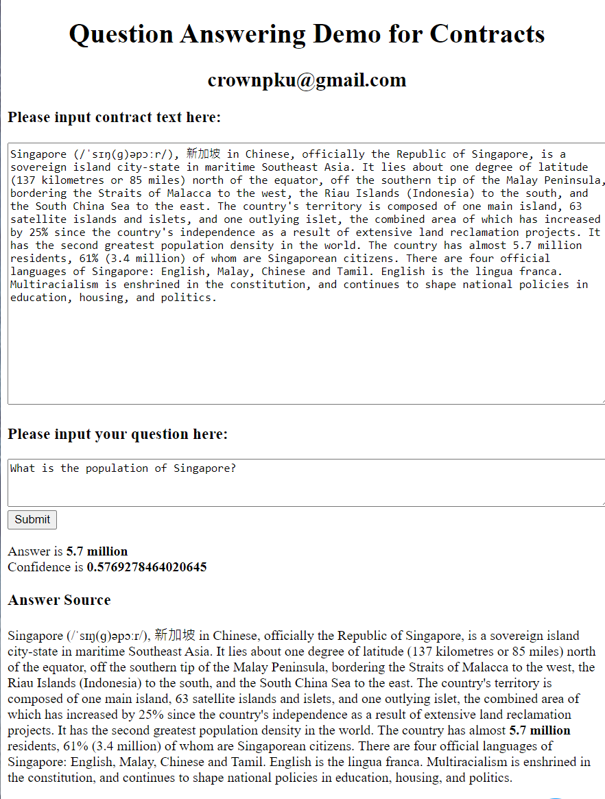

# Question_Answering_UI

A Simple UI based on Dash for Question Answering 



QA Backend is based on repo here: https://github.com/kamalkraj/BERT-SQuAD

After installing BERT-SQuAD and running it, fire up the UI by running:

```
python qa_ui_dash.py
```


